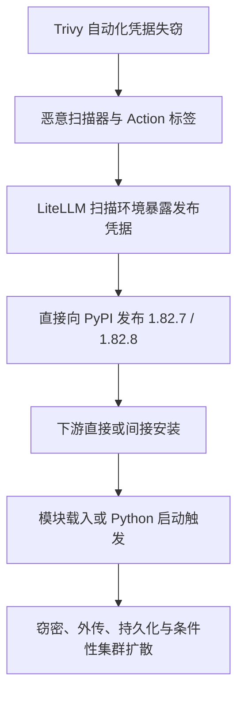

# LiteLLM 1.100 供应链疑虑：事件调查报告

本报告持续维护同一条事件线索，按事实关系重排和修订。资料核查日期：2026-09-09；时间线统一使用 UTC，必要处另列北京时间。调查对象是 LiteLLM 1.100 的制品、发布链、运行行为和供应链关联。[YouDub #130](https://github.com/liuzhao1225/YouDub-webui/pull/130)是发现线索的入口，也是评估下游影响的一个案例。

## 当前判断

已经确认三类需要处理的问题：YouDub 默认安装与“可选依赖”描述不一致；允许安装的版本超出作者声称测试的版本；特定配置切换可能保留并跨 provider 传递旧 API key。批量集成也有公开记录，值得要求作者说明使用场景及相关关系。[#130 代码与讨论](https://github.com/liuzhao1225/YouDub-webui/pull/130)、[49-PR 索引](PR-INDEX.md)。

**现有证据尚未确认 LiteLLM 1.100.0 被投毒，也未确认两个受调查账号参与攻击。** 制品与源码的一致性检查、已验证的镜像签名和前端功能来源构成需要保留的反证；它们仍未闭合原生二进制和完整构建来源问题。[制品清单](investigation/artifact-records/README.md)、[构建与前端证据](investigation/release-chain/README.md)。

#130 保持开放、未合并，调查没有修改该 PR 的代码。状态和固定 head 见[读取记录](investigation/youdub-state.json)。

## 历史投毒：攻击如何从安全扫描工具进入下游

2026 年 3 月的已确认恶意版本为 **1.82.7 和 1.82.8**。公开复盘指向以下链路：

**上游入口。** Aqua 的复盘称，2 月下旬 Trivy GitHub Actions 配置问题使特权令牌被盗；3 月 1 日轮换未覆盖全部凭据。3 月 19 日攻击者重写大量 Trivy Action 标签，并发布恶意 Trivy 0.69.4，使正常扫描任务也能先执行窃密逻辑。[Aqua 事故复盘](https://www.aquasec.com/blog/trivy-supply-chain-attack-what-you-need-to-know/)。

**进入 LiteLLM 发布链。** LiteLLM 官方将事件关联到 CI/CD 中的 Trivy 扫描依赖，认为攻击者获得发布凭据后绕过正常发布流程直接上传 PyPI。官方称 GitHub main 未被植入恶意代码，官方 Proxy 镜像因固定依赖而未包含这两个恶意包。维护者还在[3 月 24 日原始回复](https://github.com/BerriAI/litellm/issues/24518#issuecomment-4119972374)中明确描述 CircleCI 凭据泄漏包括 PyPI publish token 与 GitHub PAT。该回复为维护者自述，完整入侵细节仍应按各来源的证据程度表达。[LiteLLM 官方通报](https://docs.litellm.ai/blog/security-update-march-2026)。

**两个触发方式。** 1.82.7 在 proxy_server.py 内带有载荷；1.82.8 另外加入 litellm_init.pth。在通常加载 site 的 Python 启动过程中，后者可自动执行，无需业务代码 import LiteLLM。载荷收集环境和文件中的凭据，加密后发往 models.litellm[.]cloud，尝试建立 sysmon 持久化并从 checkmarx[.]zone 获取后续载荷；具备相应 Kubernetes 权限时还可创建特权 pod 扩散。这些行为均有触发或权限条件。[Datadog 载荷分析](https://securitylabs.datadoghq.com/articles/litellm-compromised-pypi-teampcp-supply-chain-campaign/)。

**为何被发现。** FutureSearch 的 Callum McMahon 报告，其 Cursor MCP 插件间接安装 1.82.8 后，恶意 .pth 反复启动 Python 子进程，又触发自身，造成内存耗尽。调查由此定位到恶意文件。其记录也提到披露 issue 被关闭并遭大量灌水；这些现象本身不确定评论或关闭操作的实际控制者。[发现者记录](https://futuresearch.ai/blog/litellm-pypi-supply-chain-attack/)。

**处置与遗留风险。** 恶意版本被隔离、下架；维护者轮换凭据并引入 Mandiant。3 月 30 日官方发布通过新 CI/CD 流程构建的 1.83.0。受影响环境需要排查可达凭据、持久化与下游发布，单纯替换依赖无法清除已建立的后门。[官方处置](https://docs.litellm.ai/blog/security-update-march-2026)、[事件响应分析](https://securitylabs.datadoghq.com/articles/litellm-compromised-pypi-teampcp-supply-chain-campaign/)。

Snyk 指出恶意 .pth 自身也在 wheel RECORD 中正确登记。**与索引和 RECORD 的哈希一致，只能证明拿到了登记的文件；审查和固定已验证的内容仍然必要。**[Snyk 技术分析](https://snyk.io/fr/blog/poisoned-security-scanner-backdooring-litellm/)。

## 统一时间线：注册、贡献、攻击和发布分别记录

| UTC 日期或时间 | 可核实事件 | 来源与边界 |
| --- | --- | --- |
| 2020-01-23 08:20:17 | RheagalFire 创建 | [GitHub 账号元数据](https://api.github.com/users/RheagalFire)；账号注册不等于开始集成 |
| 2020-04-07 11:19:35 | prodmanpd 创建 | [GitHub 账号元数据](https://api.github.com/users/prodmanpd)；两个账号注册日期不同 |
| 2026-03-10 至 03-11 | RheagalFire 发起的上游 staging PR 被合并 | [LiteLLM #23276](https://github.com/BerriAI/litellm/pull/23276)；多作者提交不能全部计为其原创，更不能据此认定参与后来攻击 |
| 2026-03-19 | Trivy 恶意发布及 Action 标签重写 | [Aqua 复盘](https://www.aquasec.com/blog/trivy-supply-chain-attack-what-you-need-to-know/) |
| 2026-03-24 10:39 / 10:52 | 恶意 LiteLLM 1.82.7 / 1.82.8 发布 | [Snyk 时间线](https://snyk.io/fr/blog/poisoned-security-scanner-backdooring-litellm/)、[发现者对 1.82.8 的记录](https://futuresearch.ai/blog/litellm-pypi-supply-chain-attack/) |
| 2026-03-30 | 官方宣布通过新流程发布 1.83.0 | [官方更新](https://docs.litellm.ai/blog/security-update-march-2026) |
| 2026-04-20 起 | 已定位 RheagalFire 下游 LiteLLM 集成样本 | [跨项目 PR 样本](OTHER-ACCOUNTS.zh-CN.md)；这是可见样本下限 |
| 2026-07-17 18:49:48 | prodmanpd 最早被本次检索定位的下游 PR 创建 | [llm-for-zotero #316](https://github.com/yilewang/llm-for-zotero/pull/316)，北京时间 7 月 18 日 02:49:48；28 分 6 秒内另有 4 个项目 |
| 2026-09-01 00:42–00:43 | LiteLLM 1.99.0 PyPI 上传 | [PyPI 元数据](https://pypi.org/pypi/litellm/1.99.0/json) |
| 2026-09-06 00:22 | LiteLLM 1.100.0 全部八个 PyPI 文件上传 | [带精确时间的制品记录](investigation/artifact-records/pypi-artifacts.json) |
| 2026-09-06 01:45:39 后 | Docker 构建修复合入，镜像随后完成发布 | [#39992](https://github.com/BerriAI/litellm/pull/39992)、[签名与镜像时间](updates/litellm-1.100-evidence/registry-verification.json) |
| 2026-09-08 18:46:05 | YouDub #130 创建，随后删除可选 requirements 并加入默认依赖 | [PR](https://github.com/liuzhao1225/YouDub-webui/pull/130)、[安装变更](https://github.com/liuzhao1225/YouDub-webui/commit/1add1b6d90795ddc222c3f5021305a2e8d953a17) |
| 2026-09-08 19:42 | Webclaw 维护者解释风险并关闭 PR | [维护者回复](https://github.com/0xMassi/webclaw/pull/123#issuecomment-5590829715)、[状态快照](investigation/contribution-followup/snapshot.json) |

隔离时间存在公开口径差异：LiteLLM 官方摘要称恶意版本从 10:39 UTC 起在线约 40 分钟；Snyk 记为约 3 小时，官方影响排查段落又使用更宽的窗口。本报告保留差异，排查应依据准确版本、制品和安装记录，不单凭某个分钟界限排除影响。[官方通报](https://docs.litellm.ai/blog/security-update-march-2026)、[Snyk](https://snyk.io/fr/blog/poisoned-security-scanner-backdooring-litellm/)。

## 账号与贡献行为：哪些关联已经成立

prodmanpd 的公开记录覆盖 85 个仓库、435 条可见分支和 122 个唯一提交 SHA；fork 继承、merge 与 squash 会导致逻辑重复。这些数字描述采集范围，不能代表独立功能数。49 个已定位 PR 全部围绕 LiteLLM，其中 22 个含 Python SDK 调用，27 个为代理兼容接入。按 9 月 8 日 19:47–19:50 UTC 快照，状态为 28 开放、17 合并、4 关闭未合并。[仓库元数据](data/repositories.json)、[提交记录](data/commits.json)、[PR 索引](PR-INDEX.md)、[状态核对](investigation/contribution-followup/README.md)。

[Chartbrew 作者回复](https://github.com/chartbrew/chartbrew/pull/365#issuecomment-5207856315)明确承认跨项目提交 LiteLLM 集成，解释用途是支持已有网关的团队。该回复不确立雇佣、委托或赞助关系。RheagalFire 已定位 45 个不同项目的 PR，22 个已有固定差异，23 个仅有搜索元数据待核验，并有可见 LiteLLM 上游参与经历。两个账号是否由同一方控制、是否存在商业关联，以及是否关联发布权限，仍待第一手证据。[其他账号样本](OTHER-ACCOUNTS.zh-CN.md)。

20 个出现明确数字依赖约束的 PR 都使用等价于 <2 的上限，8 个写成 <2.0.0；同时存在窄范围和锁文件反例。[约束核查](data/version-constraint-audit.json)。例如未提交 PR 的 [AI-Youtube-Shorts-Generator fork commit](https://github.com/prodmanpd/AI-Youtube-Shorts-Generator/commit/6bdf862985ea9bfad5cc4ddd14c89047067e12ce)使用 >=1.85,<1.96。版本兼容边界、常规测试替身和重复集成本身均不足以证明恶意。RheagalFire 的 [Haystack 集成](https://github.com/deepset-ai/haystack-core-integrations/blob/1af2c6606191a137ca924a8e72beeb8afb760131/integrations/litellm/pyproject.toml)还明确排除 1.82.7/1.82.8；[GuideLLM](investigation/identity-network/account-expansion/guidellm-lock-verification.json)锁定 1.95.0，16 个制品记录与 PyPI 一致。

两个历史披露 issue 的 605 条现存评论已被核对；115 个账号在攻击当天发表了 267 条精确匹配的重复文案评论，与此次 416 个候选登录名无交集。该结果限定于现存用户名及评论，不证明私下无关联。[评论筛选与交叉记录](investigation/identity-network/account-expansion/summary.json)、[历史账号角色区分](investigation/identity-network/README.md)。

## YouDub #130：下游安装与凭据案例

固定审查版本为 [1add1b6d90795ddc222c3f5021305a2e8d953a17](https://github.com/liuzhao1225/YouDub-webui/commit/1add1b6d90795ddc222c3f5021305a2e8d953a17)。

| 环节 | 观察 | 实际影响或未决问题 |
| --- | --- | --- |
| 安装范围 | 独立 requirements-litellm.txt 被删除，默认 requirements.txt 加入 litellm>=1.89.0,<2.0.0；PR 描述仍称可选 | 功能关闭或延迟 import 无法阻止默认安装；需要作者解释这项选择 |
| 版本与测试 | 作者声称测试 1.99.0，范围允许 1.100.0 和后续兼容 1.x | 新安装或升级可发生版本漂移；已有满足约束的环境未必每次自动升级 |
| 自动化测试 | 测试辅助函数将假模块放入 sys.modules；名为 end_to_end 的翻译测试同样使用它 | 验证参数与解析，未验证真实 wheel、import、副作用及外联；另有作者声称的真实端点测试，尚未独立复现 |
| 凭据迁移 | 设置保存逻辑只在 base URL 改变时要求新 key；适配器会显式传递旧的非空 key，并省略默认 OpenAI base | 若保留真实 OpenAI key 而只切换到 anthropic/...，该 key 可能随新 provider 请求发送；实际请求和泄漏尚未复现 |

来源：[依赖变更](https://github.com/liuzhao1225/YouDub-webui/commit/1add1b6d90795ddc222c3f5021305a2e8d953a17)、[PR 测试声明](https://github.com/liuzhao1225/YouDub-webui/pull/130)、[测试替身](https://github.com/liuzhao1225/YouDub-webui/blob/1add1b6d90795ddc222c3f5021305a2e8d953a17/backend/tests/test_litellm_translate.py#L17)、[设置保存](https://github.com/liuzhao1225/YouDub-webui/blob/1add1b6d90795ddc222c3f5021305a2e8d953a17/backend/app/database.py#L726)、[适配器参数](https://github.com/liuzhao1225/YouDub-webui/blob/1add1b6d90795ddc222c3f5021305a2e8d953a17/backend/app/adapters/litellm_translate.py#L50)。

凭据判断基于静态调用链：1.100 的 [Anthropic 分支](https://github.com/BerriAI/litellm/blob/e4f25265704e2b2c6cf6e81be2e4c5cffff896f4/litellm/main.py#L2802)优先使用显式 api_key，再考虑原生环境 key；默认目标是 Anthropic。适用条件包括保存着旧 provider key、未清除或替换它、切换后请求进入该分支。用户已填正确新 key、明确清除旧 key或使用独立正确配置时，结果可能不同。1.99 已有相同显式 key 优先级，该风险不能归为 1.100 独有。尚无证据表明真实用户触发过这一组合，目标也未被证明由攻击者控制。完整条件、认证头路径和反例见[依赖与凭据分析](investigation/dependency-exposure/README.md)。

作者的 [PR 描述](https://github.com/liuzhao1225/YouDub-webui/pull/130)声称实际运行过 437 项轻量测试、LiteLLM 1.99.0 解析及两条经网关的 live 调用；所列模型均为 openai/ 前缀，另称调用了 translate_batch。现有材料无法独立核实这些记录，也不能推出作者从未下载或测试 YouDub。描述仍指向已删除的可选 requirements 文件，能确认描述与当前 head 不一致；所展示路径没有验证原生 Anthropic 凭据切换，也没有证明完整项目安装与服务启动。需要作者提供对应 commit、命令、环境、锁定制品和脱敏执行记录。

本地 YouDub .venv 未发现 LiteLLM 命名的安装项；这仅覆盖该本地环境，不代表全局 Python、容器或生产。调查未执行被调查包。

## 下游维护者反馈与版本锁定的反证

[Webclaw](investigation/contribution-followup/webclaw-123.json)的固定代码允许用户配置远程 HTTP，并把专用 LiteLLM key 作为 bearer 发送。默认是 localhost，且该 Rust PR 没有新增 PyPI SDK。维护者据风险和 CI 问题关闭 PR；相关审查在 8 月 31 日已经存在。未证明真实泄漏、恶意地址或与 1.100 投毒有关。

[ClawBench 的关闭](https://github.com/TIGER-AI-Lab/ClawBench/pull/288)早于本调查通知；[新回复](https://github.com/TIGER-AI-Lab/ClawBench/pull/288#issuecomment-5590794523)仅确认此前决定和后续关注。其他项目既有接受也有拒绝，合并数不能当作受害环境数。[维护者回应与时间](investigation/contribution-followup/README.md)。

六个已完整读取的锁文件固定了 1.80.0、1.97.0 或 1.98.0，42 条 LiteLLM 制品 URL/哈希与对应 PyPI 元数据一致。[锁文件记录](data/lock-audit.json)。OpenExecutive 后来的上游同步 head 则固定 1.100.0，八个文件记录同样一致，保留其[当前快照](updates/OpenExecutive-98.json)。这些锁定行为削弱“所有贡献都会自动安装最新版本”的说法；锁文件的存在仍需结合安装入口和锁文件是否实际使用判断。

## 1.100 制品与发布链：已经验证到哪里

[六次基础 SDK 子图解析](investigation/dependency-exposure/resolution/sdk-subgraph/comparison.json)在指定 Python 3.12、Linux/macOS 平台和当前 Aliyun 索引下均包含 55 个包，宽范围选中 1.100.0；固定为 1.99.0 时，其余 54 包版本相同。88 个不同 wheel 候选的文件名/hash 与 PyPI 元数据一致；未检查所有候选实体或将结果外推到完整 YouDub 环境。

1.99.0 与 1.100.0 的基础安装声明均为 14 项，Python 要求同为 >=3.10,<3.15；差异包括可选 extras。原生 Rust 扩展在 1.99 已存在。把 boto3 或原生模块描述为 1.100 突然增加会造成误导。[两版安装元数据](investigation/runtime-paths/install-boundary.json)、[固定构建配置](https://github.com/BerriAI/litellm/blob/v1.100.0/pyproject.toml)。

| 核查对象 | 结果 | 可以支持的结论与限制 |
| --- | --- | --- |
| 下载与保存 | 7 个 1.100 wheel、1 个 1.99 wheel和两版 sdist，共十个制品 SHA 与当前 PyPI 一致 | 对应当前索引，持久副本哈希一致；索引可能登记恶意内容 |
| wheel 内部清单 | 8 个 wheel 的 27,165 项文件哈希一致，无未登记文件、异常路径或启动钩子文件 | 内部一致；不证明代码安全 |
| Python 来源 | 七平台 1.100 各 2,280 个 Python 文件与固定上游对应；Windows 的 2,202 项原始差异由 CRLF 解释 | 未发现这些包特有的 Python 内容植入；不覆盖完整机器码 |
| GHCR 镜像签名 | 1.99/1.100 的官方固定公钥签名验证通过，镜像 revision 对应标签 | 验证摘要绑定；标签自述、签名和可复现构建证明仍有区别 |
| 前端 JS | 七平台映射一致；9 个差异 chunk 拆出同样 383 组模块 ID，压缩绑定差异和 MCP API 包装已有解释，三个功能模块新增字符串及主要触发路径均映射到固定源码；14 组压缩差异无需导入排序即可归一 | 支持正常源码重建解释；两个大型 UI 模块的整体形式等价和构建复现仍未完成 |
| PyPI 构建证明 | 1.100 全部 8 个文件的 Integrity API 均返回 No provenance available | 证明在本次查询中不可取，不证明从未存在或一定投毒 |

证据：[制品清单与脚本](investigation/artifact-records/README.md)、[Python 与 Rust 源码比较](investigation/artifact-records/source-comparison.json)、[镜像签名及前端来源](updates/litellm-1.100-deep-audit-20260909.md)、[原生与 JS 模块分析](investigation/release-chain/README.md)、[八文件 provenance 响应](investigation/release-chain/integrity-all8.json)。其中 [JS 源码映射](investigation/release-chain/ts-literal-mapping.json)覆盖三个功能模块的 3、49、27 项新增解码字符串；[行为映射](investigation/release-chain/ts-behavior-mapping.json)记录用户导入回调、管理员按钮及预算 query/mutation 等触发条件。没有据此证明整个 bundle 语义等价。静态未检出结论均限定在各自检查规则与样本。

发布过程还有一项真实差异：[官方 #39992](https://github.com/BerriAI/litellm/pull/39992)记录 PyPI 成功后 Docker 构建失败，原因涉及基础镜像和 Python/uvloop 兼容性；维护者修改六个 Dockerfile 再构建，跳过已有 PyPI 上传。同一个 1.100.0 标签名不能代替分别记录 PyPI 文件 hash 和 Docker digest。现有解释未显示攻击载荷，来源证明仍按渠道核对。

Proxy/SSO 的旧漏洞告警也需按当前代码判断：1.100 默认 UI 会话为 24h，数据库 key 与 JWT 都有期限；部分撤销和 debug 数据过滤路径仍未闭合。这些是 Proxy 服务的条件性风险，SDK completion 不会自动启动 SSO HTTP 路由。[SSO 固定代码分析](updates/litellm-1.100-deep-audit-20260909.md)。

## LiteLLM 供应链的完整验证链

每项检查都对应调查中的一个问题，结果进入同一条证据链。

| 验证环节 | 已取得的证据 | 仍需补齐的证据 |
| --- | --- | --- |
| 谁提出了什么变更 | 固定 PR head、公开贡献与维护者讨论 | 作者对默认安装、测试环境及相关关系的可归属说明 |
| 哪些环境会装到什么 | 根依赖声明、锁文件反例、准确制品元数据 | 指定 Python/平台/constraints 下的完整依赖解及实际环境清单 |
| 下载内容是否对应公开来源 | 十个制品 hash、八个 RECORD、Python/Rust 源码比较、镜像签名 | PyPI 文件对应的构建证明及原生制品可复现来源 |
| 安装和运行会触发什么 | 启动钩子检查、76 项敏感调用候选的人工分流、参数及认证头路径 | 大型 UI 模块整体等价和完整机器码行为；不含真实秘密的隔离运行证据 |
| 是否发生攻击或实际影响 | 已确认的历史载荷及当前工程风险，各自标注条件 | 当前版本的恶意载荷、未授权发布证据，或可归因的窃密/持久化/外联证据 |

已审查的 76 项候选中，普通配置读取、路由注册、配置后的日志与 provider 操作分别记录；其中 25 项 Proxy client 变化主要为增加 timeout。统计不能代替调用链，也不提供检测覆盖率。对环境变量、网络请求、Python exec 等能力逐项说明激活条件，见[敏感调用判读](investigation/dependency-exposure/reviewed-candidates.json)和[可达性分析](investigation/dependency-exposure/README.md)。

当前采用静态读取和可信工具解析，不在开发机安装或执行被调查代码。以 LiteLLM 基础依赖子图为主要解析对象，YouDub 用来检验下游约束如何改变结果。只允许 wheel 时，YouDub 的 dora-search 和 openai-whisper 根依赖缺少候选；这只说明当前无执行检查方式的限制，普通源码构建仍可能成功，不能据此声称作者未下载或未测试项目。尚未执行的测试保留为未决项，证据不足时不预设最终归因。[候选可行性记录](investigation/dependency-exposure/resolution/wheel-feasibility.json)。

## 调查期间发现的伪装登录通知

维护者提供的通知由另一个 GitHub 账号创建 issue 并 @ 维护者触发。正文自称“俄罗斯登录”不能当成 GitHub 官方登录记录。原 issue 当前 404；另有 11 个作者的 14 条同模板 issue 已逐条核实，复用四个 Pages 入口，13 条迅速关闭。四个入口解码后内容完全一致，共用去活化的 user-github[.]com 跳转服务；没有执行或跟随该跳转。[钓鱼账号与源码证据](investigation/identity-network/phishing-link/README.md)。

通知正文的 15:11:54 UTC 早于 #130 创建 3 小时 34 分 11 秒。被同模板提及的 thatbrguy，其 24 个公开仓库最新 PR 仍在 2023 年；目前没有“近期接收 LiteLLM PR 后被钓鱼”的对应记录。这些结果支持批量钓鱼解释，尚未建立与 LiteLLM 贡献者的控制关系。[时间、下游及通知对照](investigation/notification-analysis/README.md)。

Atlas Cloud 的 YouDub #109 也已独立核对：9 个文件改动没有新增 LiteLLM 依赖或调用，沿用已有 OpenAI 兼容路径。该 PR 作者是 binyangzhu000-sudo；不能将另一个项目使用 LiteLLM 的实现转用于 YouDub。[固定合并差异](investigation/notification-analysis/youdub-atlas-pr.json)。

## 未决问题与调查责任

| 问题 | 需要的证据 | 负责方向 |
| --- | --- | --- |
| 原生扩展、前端及构建流程是否有无法解释的变化？ | 精确差异、平台工具链、构建 run 或可验证 attestation；必要时匹配工具链的隔离复现 | 制品与发布链 |
| 两账号和上游发布权限是否有公开关系？ | 可归属账号的公开互动、自述、提交及发布记录；区分账号关联与 author 文本 | 账号与贡献网络 |
| 实际安装与凭据路径如何受配置影响？ | 固定 head 的安装入口、锁文件使用、参数流和不含真实秘密的可复现边界用例 | 依赖与安装暴露 |
| 作者如何解释默认安装与测试声明？ | 准确制品、完整解析环境、真实依赖测试记录及使用场景说明 | 总管汇总与作者讨论 |
| 是否已经发生实际窃密？ | 环境特定的安装、执行、外联、持久化或凭据使用证据 | 总管在现有权限范围内组织核查 |

[调查职责与记录标准](INVESTIGATION-PLAN.zh-CN.md)持续维护。公开指控需要比版本范围、相似代码或集中提交更直接的证据；合理替代解释和反证与疑点一并保留。

## 证据保全与可见性

公开仓库保留[49 个 PR 及固定引用](PR-INDEX.md)、[85 个仓库元数据](data/repositories.json)、[122 个唯一提交记录](data/commits.json)、[约束](data/version-constraint-audit.json)、[锁文件](data/lock-audit.json)、[通知回读](NOTICES.md)和各技术方向证据。全文原始 API 响应、差异和下载制品另存持久本地目录。哈希不能重建已删除的原文，也不提供独立可信时间戳。

GitHub 搜索只覆盖可见且可索引内容。422、403 限流、404、空仓库的 409 和截断 diff 按实际记录解释，不计为“查无关系”或“安全通过”。账号注册不证明控制权始终不变，名字不证明国籍，未回复也不证明动机。
